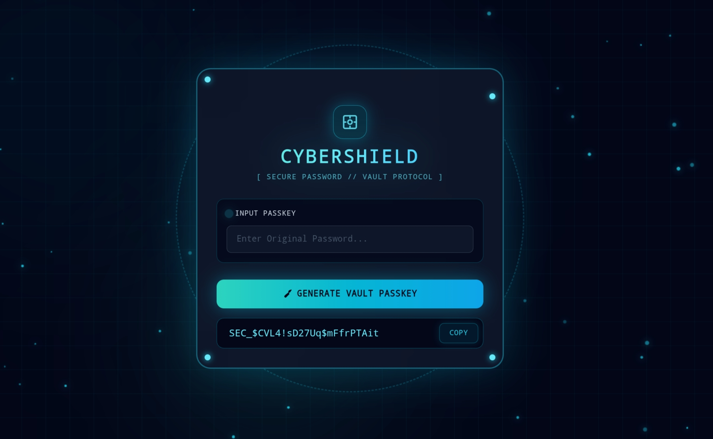

# 🛡️ CyberShield // Real-Time Password Auditor & Keygen

सायबर सुरक्षा आणि क्रिप्टोग्राफिक अल्गोरिदमवर आधारित एक आधुनिक पासवर्ड ऑडिटर आणि वॉल्ट की-जनरेटर वेब ॲप्लिकेशन.

---

## 📸 प्रोजेक्ट प्रिव्ह्यू (Project Preview)

---

## ⚡ प्रमुख वैशिष्ट्ये (Features)

* **🔐 रिअल-टाइम पासवर्ड ऑडिट (Real-Time Strength Meter):** * पासवर्डची लांबी, अक्षरे, अंक आणि स्पेशल कॅरेक्टर्स तपासून सुरक्षा पातळी (Weak, Medium, Strong) दर्शवते.
* **🔑 डिटर्मिनिस्टिक वॉल्ट की जनरेटर (Deterministic Keygen):**
  * ओरिजिनल पासवर्डमध्ये कोणताही बदल न करता **SHA-256 क्रिप्टोग्राफिक हॅश** द्वारे एक अत्यंत सुरक्षित सिक्रेट पासकी तयार केली जाते.
  * **नियम:** इनपुट पासवर्ड एकच असेल तर जनरेट होणारी वॉल्ट की सुद्धा प्रत्येक वेळी तीच राहील.
  * **सुरक्षा:** इनपुट पासवर्ड आणि जनरेट झालेली की कधीही एकसारखी नसतात.
* **🎨 सायबरपंक / सेफ व्हिज्युअल इफेक्ट्स:**
  * डिजिटल सेफ बॅकग्राउंड, रोटेटिंग डायल आणि फिरणारे निऑन सायन (Cyan) लाईट पार्टिकल्स.
* **📋 वन-क्लिक कॉपी:**
  * जनरेट झालेली की एका क्लिकवर क्लिपबोर्डवर कॉपी करण्याची सुविधा.

-

## 🚀 कसे वापरावे? (How to Use)

1. इनपुट बॉक्समध्ये तुमचा मूळ पासवर्ड टाका (`Enter Original Password...`).
2. खालील **"Generate Vault Passkey"** बटणावर क्लिक करा.
3. तयार झालेली सिक्रेट की सुरक्षित ठिकाणी कॉपी करा.
